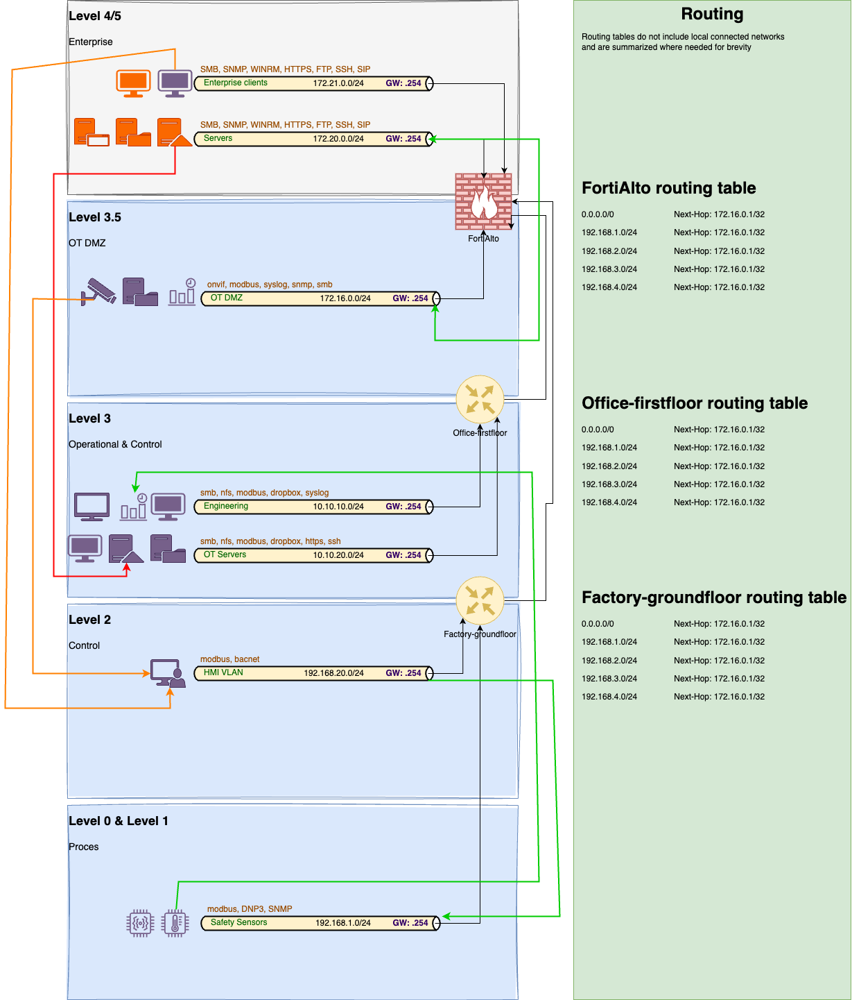

# Purdue Model Framework

A collection of Purdue model templates, depending on the need.

Sometimes it's nice to have a custom Purdue Model ready to get your point across.
I somehow noticed there aren't even any basic purdue model templates to be found on the interwebs. So i'll be dumping mine here in draw.io format.

If you hoped I was good at picking colours or making really shiny diagrams. Hah! Your loss!

## Mitre-enguinity
purdue-diagram.drawio

Used their (Mitre-enguinity) model as an inspiration, tried to use as many generic icons as possible so you can switch around their colors.

For those who are not familiar with working with draw.io: working with layers can be a pain in the butt. Make sure you keep layers you aren't using locked as much as possible to avoid dragging shapes to different layers as it really... REALLY happens more than you want it to happen. Also, grouping of items on different layers apparently isn't possible like in Visio.

## OT (network) infrastructure mapped to the Purdue Model

purdue-model-network.drawio

This Purdue Model Framework is more seen from the OT network communication view between the different levels and asset types. Its goal is to provide a high level overview of the current asset types, subnets and protocols being present. To achieve this, it's best to go over the logs of scanners (passive or active), NGFW-logs or if you really feel like going nitty gritty: a tcpdump from a TAP-port on a central switch.

This example is to show you what the network diagram could look like. Go crazy and let me know if you come up with different ideas!

